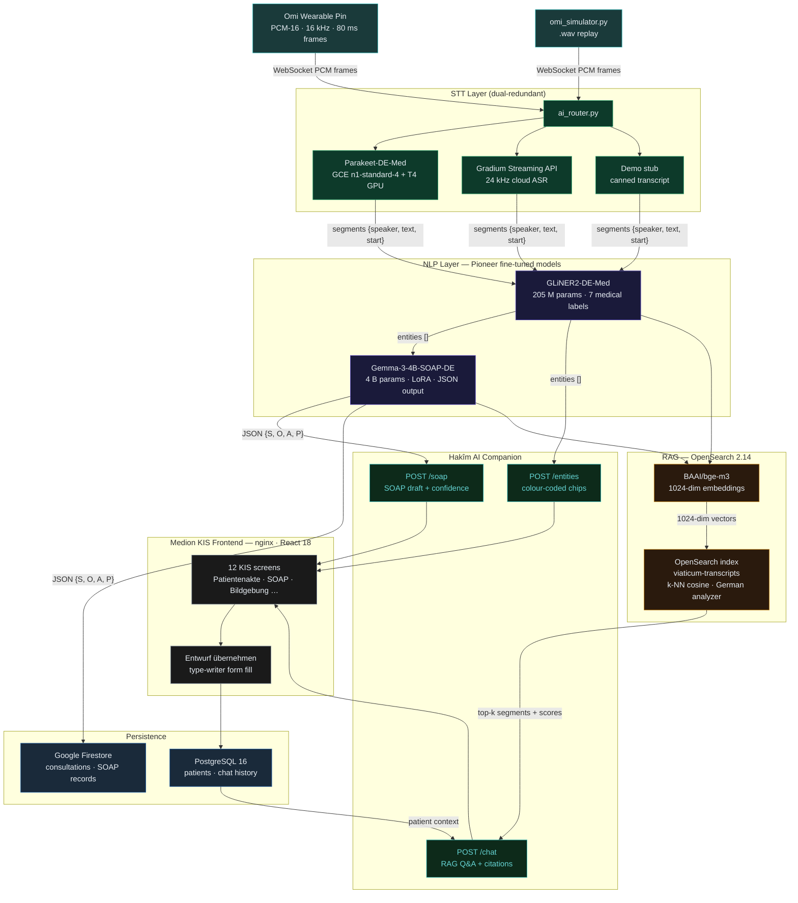

# Viaticum — Medion KIS AI Scribe

> AI-assisted SOAP documentation for German hospitals.  
> Listens → Transcribes → Structures → Fills the KIS form — without the doctor touching a keyboard.

---

## Architecture



---

## Quick start

```bash
cp .env.example .env   # fill in API keys
./start.sh             # builds images, starts OpenSearch + Postgres + backend + frontend
```

| Service    | URL                          |
|------------|------------------------------|
| KIS UI     | http://localhost:3000        |
| Backend    | http://localhost:8000/health |
| OpenSearch | https://localhost:9200       |

For a full end-to-end demo (STT → NER → SOAP → ingest → RAG):

```bash
./scripts/demo.sh
```

---

## Stack

| Layer            | Technology                          |
|------------------|-------------------------------------|
| Wearable         | Omi dev kit (Nordic Semiconductor)  |
| STT primary      | Parakeet-DE-Med (NeMo · GCE T4)     |
| STT fallback     | Gradium streaming API               |
| NER              | Pioneer GLiNER2-DE-Med (fine-tuned) |
| SOAP generation  | Pioneer Gemma-3-4B (LoRA)           |
| Embeddings       | BAAI/bge-m3 · 1024-dim              |
| Vector search    | OpenSearch 2.14 k-NN                |
| Persistence      | PostgreSQL 16 + Google Firestore    |
| Backend          | FastAPI · Python 3.11               |
| Frontend         | React 18 + nginx                    |
| Infra            | GCP Cloud Run + GCE                 |
| AI companion     | Hakîm (custom avatar agent)         |

---

## Docs

- [`docs/pipeline.md`](docs/pipeline.md) — step-by-step pipeline walkthrough
- [`docs/PIPELINE_OVERVIEW.md`](docs/PIPELINE_OVERVIEW.md) — component deep-dive
- [`docs/demo.md`](docs/demo.md) — jury demo guide
- [`docs/gcp-setup-guide.md`](docs/gcp-setup-guide.md) — GCP provisioning
- [`docs/local-hybrid-dev.md`](docs/local-hybrid-dev.md) — local dev setup
